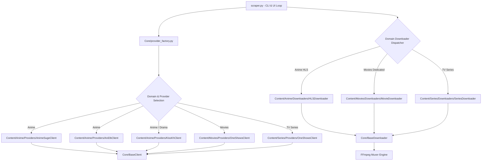

# Media Scraper - Technical Documentation

Comprehensive architecture, provider implementation details, downloader mechanics, and technical changelog for the Media Scraper codebase.

---

## 1. System Architecture

The Media Scraper is designed around a domain-modular, object-oriented architecture separating CLI orchestration, domain-specific scrapers, and purpose-built downloaders for Anime, Movies, and TV Series.



### Domain-Modular Directory Layout
- **`scraper.py`**: Main CLI entry point, interactive menu loops, parameter parsing, and batch download dispatcher.
- **`Core/`**: Foundational shared architecture:
  - [`Core/BaseClient.py`](file:///home/th3mw/DEV/CLI_DOWNLOADER/Core/BaseClient.py): Abstract scraper base class, HTTP session manager, AES/WASM decryption helpers, m3u8 parser.
  - [`Core/BaseDownloader.py`](file:///home/th3mw/DEV/CLI_DOWNLOADER/Core/BaseDownloader.py): Base downloader class, `ProgressBar` engine, subtitle sorting and FFmpeg muxing.
  - [`Core/commons.py`](file:///home/th3mw/DEV/CLI_DOWNLOADER/Core/commons.py): Global 2-space margin printer (`colprint`), `render_box` Unicode cards, universal JS runner (`exec_js`), YAML loader.
  - [`Core/provider_factory.py`](file:///home/th3mw/DEV/CLI_DOWNLOADER/Core/provider_factory.py): Dynamic provider and downloader factory registry.
- **`Content/Anime/`**: Dedicated Anime domain modules:
  - [`Content/Anime/Providers/AnimeSugeClient.py`](file:///home/th3mw/DEV/CLI_DOWNLOADER/Content/Anime/Providers/AnimeSugeClient.py): AnimeSuge provider with multi-server resolution aggregation.
  - [`Content/Anime/Providers/AniDbClient.py`](file:///home/th3mw/DEV/CLI_DOWNLOADER/Content/Anime/Providers/AniDbClient.py): AniDB provider with multi-language HLS streams and `.xls` segment sanitization.
  - [`Content/Anime/Providers/KissKhClient.py`](file:///home/th3mw/DEV/CLI_DOWNLOADER/Content/Anime/Providers/KissKhClient.py): KissKh provider (Anime filter).
  - [`Content/Anime/Downloaders/HLSDownloader.py`](file:///home/th3mw/DEV/CLI_DOWNLOADER/Content/Anime/Downloaders/HLSDownloader.py): High-performance HLS segment downloader with MKV output & forced subtitles.
- **`Content/Movies/`**: Dedicated Movies domain modules:
  - [`Content/Movies/Providers/OneShowsClient.py`](file:///home/th3mw/DEV/CLI_DOWNLOADER/Content/Movies/Providers/OneShowsClient.py): 1Shows movie provider (TMDb search + WASM decryption).
  - [`Content/Movies/Providers/KissKhClient.py`](file:///home/th3mw/DEV/CLI_DOWNLOADER/Content/Movies/Providers/KissKhClient.py): KissKh Asian drama movie provider.
  - [`Content/Movies/Downloaders/MovieDownloader.py`](file:///home/th3mw/DEV/CLI_DOWNLOADER/Content/Movies/Downloaders/MovieDownloader.py): Dedicated continuous streaming movie downloader with HTTP range resumption and rate-limit mitigation.
- **`Content/Series/`**: Dedicated TV Shows & Asian Dramas domain modules:
  - [`Content/Series/Providers/KissKhClient.py`](file:///home/th3mw/DEV/CLI_DOWNLOADER/Content/Series/Providers/KissKhClient.py): KissKh TV series provider.
  - [`Content/Series/Providers/OneShowsClient.py`](file:///home/th3mw/DEV/CLI_DOWNLOADER/Content/Series/Providers/OneShowsClient.py): 1Shows TV series provider.
  - [`Content/Series/Downloaders/SeriesDownloader.py`](file:///home/th3mw/DEV/CLI_DOWNLOADER/Content/Series/Downloaders/SeriesDownloader.py): Multi-episode TV series downloader.

---

## 2. Provider Implementations & Mechanics

### AniDB Client (`Clients/AniDbClient.py`)
- **API & Browse Scraping**: Scrapes search cards from `/browse?q={query}` (with fallback to `/search/suggestions?q=`), parsing anime title, type (`[TV]`, `[MOVIE]`, `[SPECIAL]`), rating, and slug IDs.
- **Frontend REST APIs**: Directly queries `/api/frontend/anime/{id}/episodes` to retrieve full episode lists and `/api/frontend/episode/{id}/languages` to resolve multi-language audio streams (`jpn`, `eng`, `kor`).
- **HLS Stream Parsing**: Extracts JWPlayer `master.m3u8` streams and parses multi-bitrate resolution tiers (`1080p`, `720p`, `360p`).
- **Segment Sanitization**: Downloads `.xls` MPEG-TS segments and sanitizes extensions to `.ts` for FFmpeg remuxing.

### AnimeSuge Client (`Clients/AnimeSugeClient.py`)
- **VRF Token Algorithm**: Implements a 5-stage verification token generator required by AnimeSuge AJAX endpoints:
  1. RC4 cipher with key `"ysJhV6U27FVIjjuk"`
  2. Base64 encoding
  3. Character shifting in a repeating mod 8 pattern (`-3, +3, -4, +2, -2, +5, +4, +5`)
  4. Base64 encoding
  5. ROT13 cipher
- **Search & Card Formatting**: Scrapes HTML search results and concurrently queries `/ajax/anime/tooltip/{id}` using `ThreadPoolExecutor` to extract status (`Finished Airing` / `Currently Airing`), release year, content type (`[TV]`, `[MOVIE]`, `[ONA]`), and sub/dub episode breakdowns (`24 (Sub: 24, Dub: 12)`). Formats results into structured 2-line cards matching KissKh display styles.
- **VidTube Embed Scraper**: Parses iframe embeds (`https://vidtube.site/e/{id}`), calls `getSourcesNew`, extracts quality `.m3u8` playlists, and parses `tracks` JSON arrays for WebVTT (`.vtt`) subtitle tracks.
- **Concurrent Link Resolution**: Uses `ThreadPoolExecutor(max_workers=min(10, len(selected_eps)))` to resolve episode links in parallel, reducing fetch times by ~9x.

### KissKh Client (`Clients/KissKhClient.py`)
- **API Endpoints**: Communicates directly with KissKh JSON REST APIs (`/api/DramaList/Search`, `/api/DramaList/Drama`, `/api/DramaList/Episode`).
- **Dynamic JavaScript Token Generation**: Employs `exec_js` from `Utils.commons` to execute `common.js` and evaluate `_0x54b991` for `kkey` generation across available JS runtimes (`bun`, `node`, `deno`, or `quickjs`).
- **Encrypted Subtitles & Video Payloads**: Decrypts AES-encrypted subtitle payloads (`.txt` / `.txt1`) and video streams using custom AES-CBC key/IV pairs.
- **Null Safety & Resilience**: Implements `None` guards around search/series responses to prevent crashes during API rate limiting or temporary outages.

### OneShows Client (`Clients/OneShowsClient.py`)
- **TMDb Search API**: Direct querying of TMDb endpoints (`/api/search/query`, `/api/tv/`) for high-fidelity movie and TV series metadata.
- **WebAssembly Payload Decryption**: Downloads `makimaDL-manifest.json` and `makimaDL.wasm`, decrypting AES-GCM stream payloads via the JS runtime runner (`exec_js`).
- **Variety Selection & Mirror Resolution**: Presents available download varieties (Source + Resolution + Size) and resolves intermediate mirrors (PixelDrain, GoodStream) into direct download links.

---

## 3. Downloader Engine & Network Resilience

### HLS Downloader (`Utils/HLSDownloader.py`)
1. **Segment Renaming (`_sanitize_segment_name`)**: CDNs frequently serve HLS video segments with misleading extensions (`.png`, `.jpg`) or without extensions. The downloader renames all non-media extensions to `.ts` so FFmpeg's HLS demuxer accepts them without throwing `not in allowed_segment_extensions` errors.
2. **Obfuscation Stripping (`_strip_png_header`)**: Certain CDNs (e.g. VidTube) prepend fake 8-byte PNG headers (`0x89PNG\r\n\x1a\n`) to MPEG-TS streams. The downloader scans for the first 188-byte aligned TS sync byte (`0x47`) and strips the leading fake header bytes before writing segment files.
3. **Local Playlist Rewriting (`_rewrite_m3u8_file`)**: Rewrites the `.m3u8` playlist file to reference local downloaded `.ts` segment files and encryption keys.
4. **FFmpeg Remuxing (`_convert_to_mp4`)**: Executes FFmpeg with `-y` (overwrite), `-allowed_extensions ALL`, stream mapping (`-map 0:v -map 0:a -map {i}`), ISO 639-2 language tags (`-metadata:s:{stream_idx} language=eng`), and disposition flags (`-disposition:{stream_idx} default+forced`).

### Network & Transport Layer
- **IPv4 Socket Enforcement**: `urllib3.util.connection.allowed_gai_family = lambda: socket.AF_INET` forces IPv4 to avoid IPv6 connection drops on Linux.
- **Encoding Headers**: Standardized `Accept-Encoding: gzip, deflate` across HTTP sessions to prevent unhandled raw Brotli compression payloads.
- **Rate Limit Backoff**: `@retry()` decorator in `BaseClient._send_request()` handles HTTP 429 rate limit responses with exponential backoff (`time.sleep(2)`).
- **Multi-Engine JS Runner**: `exec_js()` automatically detects CLI runtimes (`bun`, `node`, `deno`, `qjs`) or falls back to the embedded `quickjs` Python module.

---

## 4. Subtitle Subsystem & MKV Auto-Activation

### VTT to SRT Conversion (`Utils/BaseDownloader.py`)
When subtitle tracks are downloaded in WebVTT (`.vtt`) format, `_download_subtitles()` automatically converts them to SubRip (`.srt`) format using FFmpeg:
```bash
ffmpeg -y -loglevel warning -i "sub_file.vtt" "sub_file.srt"
```

### MKV Subtitle Multiplexing (`FlagDefault` & `FlagForced`)
- **Default Container (`.mkv`)**: All downloaded video files with soft subtitles are packaged as Matroska (`.mkv`) files.
- **Native SubRip Encoding (`-c:s srt`)**: Subtitles are stored in native SubRip format rather than being compressed to MP4's limited `mov_text`.
- **Automatic Display in VLC & Media Players**: FFmpeg applies `-disposition:s:{idx} default+forced` which writes Matroska `FlagDefault=1` and `FlagForced=1` header flags.
- **Player Compatibility**: VLC, MPV, IINA, Celluloid, Kodi, Plex, and Jellyfin immediately auto-render the subtitle track on startup without requiring manual track selection or hotkey presses.

---

## 5. Technical Changelog & Historical Bug Fixes

| Issue | Commit / File | Summary & Fix |
|-------|---------------|---------------|
| **`aria2c` In-Place Progress Stream & Terminal Output Fix** | `Content/Movies/Downloaders/TorrentDownloader.py` | Configured `--summary-interval=0`, `--console-log-level=error`, and `--show-console-readout=true` to update single-line download progress in place rather than printing periodic multi-line summary boxes. |
| **Cross-Platform Magnet Handler (Windows, macOS, Linux)** | `Content/Movies/Downloaders/TorrentDownloader.py` | Added multi-OS default torrent client dispatching (`os.startfile` on Windows, `open` on macOS, `xdg-open` on Linux) with in-terminal `aria2c` support and copyable magnet card fallback. |
| **Single-Step Torrent Quality Selection & `ep_details` Fix** | `Content/Movies/Providers/YTSClient.py`, `Core/BaseDownloader.py`, `scraper.py` | Enabled direct numbered selection of torrent releases (Bluray vs Web, multiple bitrates) skipping redundant resolution prompts, and fixed `self.ep_details` attribute binding in `BaseDownloader`. |
| **Global Package Installation & Module Packaging Fix** | `pyproject.toml`, `Core/commons.py` | Added `Core*` and `Content*` to `[tool.setuptools.packages.find]` and added XDG config directory resolution (`~/.config/media-scraper/`) for standalone `media-scraper` CLI installations. |
| **YTS Movie Torrents Provider & TorrentDownloader Engine** | `Content/Movies/Providers/YTSClient.py`, `Content/Movies/Downloaders/TorrentDownloader.py`, `Core/provider_factory.py`, `scraper.py` | Added official YTS/YIFY multi-mirror torrent provider (720p, 1080p, 4K UHD) with seed/peer metrics, 14 public trackers, and `TorrentDownloader` engine with `aria2c` / `xdg-open` fallback. |
| **Domain-Modular Architecture & Dedicated MovieDownloader** | `Core/`, `Anime/`, `Movies/`, `Series/`, `scraper.py` | Restructured codebase into domain folders (`Anime/Providers/`, `Anime/Downloaders/`, `Movies/Providers/`, `Movies/Downloaders/`, `Series/Providers/`, `Series/Downloaders/`, and `Core/`), and implemented dedicated streaming `MovieDownloader` with HTTP range resume support. |
| **AnimeSuge Multi-Resolution Aggregation** | `Clients/AnimeSugeClient.py` | Aggregated available resolutions (1080p, 720p, 480p, 360p) across available servers instead of returning early on single-resolution master streams. |
| **1Shows Movie WASM Decryption & Auto-Selection** | `Clients/OneShowsClient.py`, `Clients/BaseClient.py`, `scraper.py` | Fixed WASM bytes download in payload decryption, formatted variety selection menu in Unicode cards, and auto-selected single movies without redundant episode range prompts. |
| **`KissKhClient` `get_season_ep_ranges` Missing Attribute** | `Clients/BaseClient.py` | Implemented `get_season_ep_ranges` on `BaseClient` so all providers inherit season/episode extraction. |
| **Purged Duplicate Raw Search Output** | `AniDbClient.py`, `AnimeSugeClient.py`, `KissKhClient.py`, `OneShowsClient.py` | Removed raw `_colprint` in client `search()` methods so only the formatted Unicode card is rendered. |
| **Terminal Margin Indentation & Breathing Room** | `Utils/commons.py`, `scraper.py`, `BaseDownloader.py` | Added 2-space left margin to cards (`render_box`), user prompts, and live progress bars so UI isn't glued to the terminal edge. |
| **Download List Progress Bar Overlapping Fix** | `scraper.py`, `Utils/BaseDownloader.py` | Enabled clean sequential episode downloading with per-episode progress bars, line clearing (`\033[K`), and discrete completion receipts. |
| **Modern CLI & Interactive UI Overhaul** | `scraper.py`, `Utils/commons.py`, `Utils/BaseDownloader.py` | Complete visual overhaul with `render_box` Unicode cards, smooth gradient progress bars (`━╸─`), `--search-only`, `--dry-run`, `-q`, and `--no-color`. |
| **Provider Menu `0. Back` Navigation** | `scraper.py` | Added `0. Back` navigation across all provider menus to easily return to content type selection. |
| **Auto-Skip Existing Episodes** | `scraper.py` | Detects completed files (>1MB) in target output directory and skips re-downloading them. |
| **`episodes` Undefined Variable Fix** | `scraper.py` | Passed `episodes` into `get_ep_range_multiple` and restricted multi-season prompts to TV Shows with >1 seasons. |
| **English Subtitle Default Priority** | `HLSDownloader.py`, `BaseDownloader.py` | Sorted subtitle tracks so English is always stream 0 with `default+forced` flags. |
| **Incomplete Download Cache Resumption** | `HLSDownloader.py`, `BaseDownloader.py` | Detected cached segments on startup and seamlessly resumed remaining segments without duplicating cache. |
| **HLS Query Params & Extension Rejection Fix** | `Utils/HLSDownloader.py` | Upgraded `_sanitize_segment_name` to strip query strings (`.jpg?mod=1`) and rewritten playlists to enforce `.ts` segments for FFmpeg. |
| **AniDB `show_episode_results` Signature Fix** | `Clients/AniDbClient.py` | Added `*predefined_range` variadic argument support to `show_episode_results` matching `scraper.py` dispatcher. |
| **MKV Container with Forced Subtitles** | `BaseClient.py`, `HLSDownloader.py`, `BaseDownloader.py` | Transitioned output container to MKV (`.mkv`) with SubRip (`srt`) and `default+forced` flags for auto-activation in VLC. |
| **AniDB Provider Integration** | `Clients/AniDbClient.py`, `Utils/provider_factory.py` | Added AniDB (`anidb.app`) provider client with multi-language HLS streams and `.xls` segment sanitization. |
| **AnimeSuge Embed 404 Fix** | `Clients/AnimeSugeClient.py` | Added dynamic domain origin extraction (`getSourcesNew` / `getSources`) and multi-server fallback. |
| **`tqdm` Missing Module Fallback** | `Utils/BaseDownloader.py` | Added lightweight self-contained progress bar fallback when `tqdm` is not installed. |
| **`NoneType` block_size Crash** | `Clients/BaseClient.py` | Added safe fallback `self.bs = AES.block_size if AES is not None else 16` and AES availability guards. |
| **`quickjs` Import Failure** | `Clients/KissKhClient.py`, `Utils/commons.py` | Built universal `exec_js` runner with auto-detection for `bun`, `node`, `deno`, and optional `quickjs`. |
| **WASM Decryption in 1Shows** | `Clients/OneShowsClient.py` | Integrated `exec_js` for WASM decryption supporting Bun/Node/Deno runtimes. |
| **Purged AnimePahe Provider** | Full Repository | Removed AnimePahe client, pycache, and documentation remnants. |
| **`resolution_size` KeyError** | `Clients/BaseClient.py` | Added safe `.get('resolution_size', 'NA')` fallbacks. |
| **`downloadLink` KeyError** | `Clients/KissKhClient.py` | Standardized resolution dict keys to `downloadLink` and `downloadType`. |
| **FFmpeg PNG Segment Rejection** | `Utils/HLSDownloader.py` | Implemented `_sanitize_segment_name()` to map misleading `.png` extensions to `.ts`. |
| **Fake PNG Header Obfuscation** | `Utils/HLSDownloader.py` | Implemented `_strip_png_header()` to locate `0x47` sync bytes and strip PNG headers. |
| **Non-Interactive TTY Error** | `scraper.py` | Added `try/except` around `os.get_terminal_size()` with fallback width `80`. |
| **KissKh 429 Rate Limit Crash** | `Clients/BaseClient.py`, `KissKhClient.py` | Fixed `Accept-Encoding`, enforced IPv4 sockets, added 429 retry backoff and null response guards. |
| **AnimeSuge Structured 2-Line Cards** | `Clients/AnimeSugeClient.py` | Extracted status, year, sub/dub counts, and formatted 2-line UI cards. |
| **Parallel Link Fetching** | `AnimeSugeClient.py`, `KissKhClient.py`, `OneShowsClient.py` | Added `ThreadPoolExecutor` concurrent link resolution (~9x speedup). |
| **VTT to SRT Conversion** | `Utils/BaseDownloader.py` | Added automatic VTT -> SRT conversion prior to MP4 remuxing. |
