# Media Scraper - Technical Documentation

Comprehensive architecture, provider implementation details, downloader mechanics, and technical changelog for the Media Scraper codebase.

---

## 1. System Architecture

The Media Scraper is designed around a modular, object-oriented architecture separating CLI orchestration, provider-specific web scraping, network resilience, and media downloading/remuxing engines.

```mermaid
flowchart TD
    CLI[scraper.py - CLI & UI Loop] --> Factory[provider_factory.py]
    Factory --> ClientChoice{Category & Provider Selection}
    ClientChoice -->|Anime| AnimeSuge[AnimeSugeClient]
    ClientChoice -->|Anime / Drama| KissKh[KissKhClient]
    ClientChoice -->|Movies / TV| OneShows[OneShowsClient]
    
    AnimeSuge --> BaseClient[BaseClient]
    KissKh --> BaseClient
    OneShows --> BaseClient

    CLI --> DownloaderChoice{Download Type}
    DownloaderChoice -->|Direct HTTP Chunks| BaseDownloader[BaseDownloader]
    DownloaderChoice -->|HLS / M3U8 Streams| HLSDownloader[HLSDownloader]
    
    HLSDownloader --> BaseDownloader
    HLSDownloader --> FFmpeg[FFmpeg Muxer Engine]
    BaseDownloader --> FFmpeg
```



### Core Directory Layout
- **`scraper.py`**: CLI entry point, argument parsing (`argparse`), interactive prompts, menu loops, and batch downloader dispatching.
- **`Clients/`**: Provider implementations inheriting from `BaseClient`.
  - [`BaseClient.py`](file:///home/th3mw/DEV/CLI_DOWNLOADER/Clients/BaseClient.py): Abstract base class, HTTP request wrapper with session pooling, parallel link fetching manager, search results display formatter.
  - [`AnimeSugeClient.py`](file:///home/th3mw/DEV/CLI_DOWNLOADER/Clients/AnimeSugeClient.py): AnimeSuge provider scraper.
  - [`KissKhClient.py`](file:///home/th3mw/DEV/CLI_DOWNLOADER/Clients/KissKhClient.py): KissKh provider scraper (Anime, Asian Drama, Movies & TV Shows).
  - [`OneShowsClient.py`](file:///home/th3mw/DEV/CLI_DOWNLOADER/Clients/OneShowsClient.py): 1Shows provider scraper (Movies & TV Shows with WASM decryption).
- **`Utils/`**: Downloader and shared utility modules.
  - [`provider_factory.py`](file:///home/th3mw/DEV/CLI_DOWNLOADER/Utils/provider_factory.py): Dynamic provider registry and factory instantiation.
  - [`BaseDownloader.py`](file:///home/th3mw/DEV/CLI_DOWNLOADER/Utils/BaseDownloader.py): Direct MP4 downloader, multi-threaded chunk pool (4MiB chunks), subtitle downloader & converter.
  - [`HLSDownloader.py`](file:///home/th3mw/DEV/CLI_DOWNLOADER/Utils/HLSDownloader.py): HLS `.m3u8` playlist parser, obfuscated TS segment header stripper, local m3u8 playlist rewriter, FFmpeg remuxing engine.
  - [`commons.py`](file:///home/th3mw/DEV/CLI_DOWNLOADER/Utils/commons.py): Retry decorators, multi-engine JS runtime runner (`exec_js`), subprocess execution, terminal coloring utilities.

---

## 2. Provider Implementations & Mechanics

### AnimeSuge Client (`Clients/AnimeSugeClient.py`)
- **VRF Token Algorithm**: Implements a 5-stage verification token generator required by AnimeSuge AJAX endpoints:
  1. RC4 cipher with key `"ysJhV6U27FVIjjuk"`
  2. Base64 encoding
  3. Character shifting in a repeating mod 8 pattern (`-3, +3, -4, +2, -2, +5, +4, +5`)
  4. Base64 encoding
  5. ROT13 cipher
- **Search & Card Formatting**: Scrapes HTML search results and concurrently queries `/ajax/anime/tooltip/{id}` using `ThreadPoolExecutor` to extract status (`Finished Airing` / `Currently Airing`), release year, content type (`[TV]`, `[MOVIE]`, `[ONA]`), and sub/dub episode breakdowns (`24 (Sub: 24, Dub: 12)`). Formats results into structured 2-line cards matching KissKh display styles.
- **VidTube Embed Scraper**: Parses iframe embeds (`https://vidtube.site/e/{id}`), calls `getSourcesNew`, extracts quality `.m3u8` playlists, and parses `tracks` JSON arrays for WebVTT (`.vtt`) subtitle tracks.
- **Concurrent Link Resolution**: Uses `ThreadPoolExecutor(max_workers=min(10, len(selected_eps)))` to resolve episode links in parallel, reducing fetch times by ~9x.

### KissKh Client (`Clients/KissKhClient.py`)
- **API Endpoints**: Communicates directly with KissKh JSON REST APIs (`/api/DramaList/Search`, `/api/DramaList/Drama`, `/api/DramaList/Episode`).
- **Dynamic JavaScript Token Generation**: Employs `exec_js` from `Utils.commons` to execute `common.js` and evaluate `_0x54b991` for `kkey` generation across available JS runtimes (`bun`, `node`, `deno`, or `quickjs`).
- **Encrypted Subtitles & Video Payloads**: Decrypts AES-encrypted subtitle payloads (`.txt` / `.txt1`) and video streams using custom AES-CBC key/IV pairs.
- **Null Safety & Resilience**: Implements `None` guards around search/series responses to prevent crashes during API rate limiting or temporary outages.

### OneShows Client (`Clients/OneShowsClient.py`)
- **TMDb Search API**: Direct querying of TMDb endpoints (`/api/search/query`, `/api/tv/`) for high-fidelity movie and TV series metadata.
- **WebAssembly Payload Decryption**: Downloads `makimaDL-manifest.json` and `makimaDL.wasm`, decrypting AES-GCM stream payloads via the JS runtime runner (`exec_js`).
- **Variety Selection & Mirror Resolution**: Presents available download varieties (Source + Resolution + Size) and resolves intermediate mirrors (PixelDrain, GoodStream) into direct download links.

---

## 3. Downloader Engine & Network Resilience

### HLS Downloader (`Utils/HLSDownloader.py`)
1. **Segment Renaming (`_sanitize_segment_name`)**: CDNs frequently serve HLS video segments with misleading extensions (`.png`, `.jpg`) or without extensions. The downloader renames all non-media extensions to `.ts` so FFmpeg's HLS demuxer accepts them without throwing `not in allowed_segment_extensions` errors.
2. **Obfuscation Stripping (`_strip_png_header`)**: Certain CDNs (e.g. VidTube) prepend fake 8-byte PNG headers (`0x89PNG\r\n\x1a\n`) to MPEG-TS streams. The downloader scans for the first 188-byte aligned TS sync byte (`0x47`) and strips the leading fake header bytes before writing segment files.
3. **Local Playlist Rewriting (`_rewrite_m3u8_file`)**: Rewrites the `.m3u8` playlist file to reference local downloaded `.ts` segment files and encryption keys.
4. **FFmpeg Remuxing (`_convert_to_mp4`)**: Executes FFmpeg with `-y` (overwrite), `-allowed_extensions ALL`, stream mapping (`-map 0:v -map 0:a -map {i}`), ISO 639-2 language tags (`-metadata:s:{stream_idx} language=eng`), and disposition flags (`-disposition:{stream_idx} default+forced`).

### Network & Transport Layer
- **IPv4 Socket Enforcement**: `urllib3.util.connection.allowed_gai_family = lambda: socket.AF_INET` forces IPv4 to avoid IPv6 connection drops on Linux.
- **Encoding Headers**: Standardized `Accept-Encoding: gzip, deflate` across HTTP sessions to prevent unhandled raw Brotli compression payloads.
- **Rate Limit Backoff**: `@retry()` decorator in `BaseClient._send_request()` handles HTTP 429 rate limit responses with exponential backoff (`time.sleep(2)`).
- **Multi-Engine JS Runner**: `exec_js()` automatically detects CLI runtimes (`bun`, `node`, `deno`, `qjs`) or falls back to the embedded `quickjs` Python module.

---

## 4. Subtitle Subsystem & Known Limitations

### VTT to SRT Conversion (`Utils/BaseDownloader.py`)
When subtitle tracks are downloaded in WebVTT (`.vtt`) format, `_download_subtitles()` automatically converts them to SubRip (`.srt`) format using FFmpeg:
```bash
ffmpeg -y -loglevel warning -i "sub_file.vtt" "sub_file.srt"
```
Converting to `.srt` before encoding into MP4 `mov_text` ensures that subtitle bounding boxes and text styles render properly across media players.

### ⚠️ Known Subtitle Limitations (MP4 Soft Subtitles)
- **Container Constraints**: In `.mp4` containers, soft subtitles are encoded as 3GPP Timed Text (`mov_text`).
- **Player-Dependent Rendering**: Different desktop and mobile media players (VLC, Celluloid, MPV, Windows Media Player, Smart TVs) handle embedded soft subtitles in MP4 containers differently:
  - Some players automatically load and render `mov_text` tracks when marked `default+forced` and tagged with ISO language codes (`eng`).
  - Other players require manually selecting the subtitle track from the player's Audio/Subtitles menu or pressing the player's subtitle hotkey (e.g. `v` in MPV/Celluloid).
- **Recommendation**: If your media player does not display soft subtitles automatically in `.mp4` files, enable the subtitle track manually in your player settings or extract the `.srt` file alongside the video.

---

## 5. Technical Changelog & Historical Bug Fixes

| Issue | Commit / File | Summary & Fix |
|-------|---------------|---------------|
| **`NoneType` block_size Crash** | `Clients/BaseClient.py` | Added safe fallback `self.bs = AES.block_size if AES is not None else 16` and AES availability guards. |
| **`quickjs` Import Failure** | `Clients/KissKhClient.py`, `Utils/commons.py` | Built universal `exec_js` runner with auto-detection for `bun`, `node`, `deno`, and optional `quickjs`. |
| **WASM Decryption in 1Shows** | `Clients/OneShowsClient.py` | Integrated `exec_js` for WASM decryption supporting Bun/Node/Deno runtimes. |
| **Purged AnimePahe Provider** | Full Repository | Removed AnimePahe client, pycache, and documentation remnants. |
| **`resolution_size` KeyError** | `Clients/BaseClient.py` | Added safe `.get('resolution_size', 'NA')` fallbacks. |
| **`downloadLink` KeyError** | `Clients/KissKhClient.py` | Standardized resolution dict keys to `downloadLink` and `downloadType`. |
| **FFmpeg PNG Segment Rejection** | `Utils/HLSDownloader.py` | Implemented `_sanitize_segment_name()` to map misleading `.png` extensions to `.ts`. |
| **Fake PNG Header Obfuscation** | `Utils/HLSDownloader.py` | Implemented `_strip_png_header()` to locate `0x47` sync bytes and strip PNG headers. |
| **Non-Interactive TTY Error** | `scraper.py` | Added `try/except` around `os.get_terminal_size()` with fallback width `80`. |
| **KissKh 429 Rate Limit Crash** | `Clients/BaseClient.py`, `KissKhClient.py` | Fixed `Accept-Encoding`, enforced IPv4 sockets, added 429 retry backoff and null response guards. |
| **AnimeSuge Structured 2-Line Cards** | `Clients/AnimeSugeClient.py` | Extracted status, year, sub/dub counts, and formatted 2-line UI cards. |
| **Parallel Link Fetching** | `AnimeSugeClient.py`, `KissKhClient.py`, `OneShowsClient.py` | Added `ThreadPoolExecutor` concurrent link resolution (~9x speedup). |
| **VTT to SRT Conversion** | `Utils/BaseDownloader.py` | Added automatic VTT -> SRT conversion prior to MP4 remuxing. |
