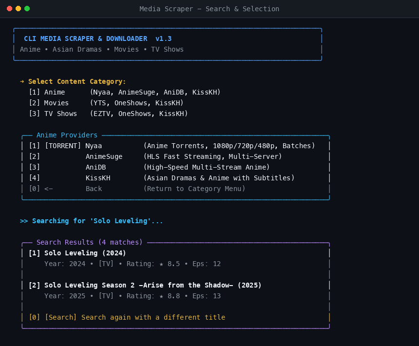
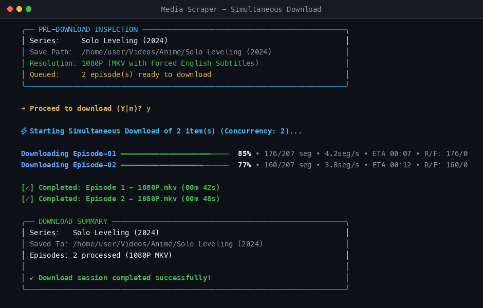

# 🎬 Media Scraper

A powerful command-line interface (CLI) application for searching and downloading Anime, Movies, and TV Shows from multiple online providers with high performance, resolution selection, parallel link fetching, and automated HLS segment processing.

---

## 📖 Table of Contents
- [Features](#-features)
- [Screenshots](#-screenshots)
- [Installation](#-installation)
- [Quick Start](#-quick-start)
- [Command Line Interface (CLI) Usage](#-command-line-interface-cli-usage)
- [Supported Providers](#-supported-providers)
- [Configuration](#-configuration)
- [Subtitle & Media Player Notes](#-subtitle--media-player-notes)
- [Technical Documentation](#-technical-documentation)
- [License](#-license)

---

## ✨ Features

- **Multi-Source Scraping**: Download content seamlessly from top Anime and Movie/TV Show providers.
- **Download Resumption**: Automatic segment/chunk caching. Interrupted downloads resume from where they left off without re-downloading existing segments.
- **Fast Parallel Fetching**: Concurrent episode link resolution (~9x speedup using multi-threaded execution).
- **Structured 2-Line Search Cards**: Rich search results displaying episode counts, sub/dub availability, release year, airing status, and content types (`[TV]`, `[MOVIE]`, `[ONA]`, `[SPECIAL]`).
- **Resolution Control**: Download in your preferred video quality (360p, 720p, 1080p).
- **HLS / M3U8 Downloader**: Automated segment downloading, PNG obfuscation stripping, and FFmpeg MP4 remuxing.
- **Subtitle Extraction & Conversion**: Automatic extraction and WebVTT-to-SRT conversion embedded into downloaded MP4 files.
- **Network Resilience**: Automatic HTTP 429 rate-limit retries, IPv4 socket enforcement, and Cloudflare Turnstile challenge solving.
- **Interactive & Non-Interactive CLI**: Run interactively or automate via command-line flags.

---

## 📷 Screenshots

Here is the Media Scraper in action:




---

## 📦 Installation

### Prerequisites
- **Python 3.8+**
- **FFmpeg** (installed and available in your system `PATH`)

### Global CLI Installation (Recommended)

Install globally from GitHub using `pipx` or `uv tool` to make the `media-scraper` command available everywhere on your system:

#### Option A: Using `pipx` (Recommended)
```bash
pipx install git+https://github.com/iamitkrp/CLI_DOWNLOADER.git
```

#### Option B: Using `uv tool`
```bash
uv tool install git+https://github.com/iamitkrp/CLI_DOWNLOADER.git
```

#### Option C: Local Editable Install
```bash
git clone https://github.com/iamitkrp/CLI_DOWNLOADER.git
cd CLI_DOWNLOADER
pip install -e .
```

After installation, run `media-scraper` from any terminal directory:
```bash
media-scraper
```

---

## 🚀 Quick Start

Launch the interactive CLI wizard:
```bash
media-scraper
```
(or run `python scraper.py` locally from the repository folder)

The interactive wizard will guide you through:
1. Selecting **Anime** or **Movies & Shows**
2. Searching for titles
3. Selecting episodes or season ranges
4. Choosing video resolution (360p, 720p, 1080p)
5. Starting parallel episode downloads

---

## 💻 Command Line Interface (CLI) Usage

### Command Line Arguments

```bash
python scraper.py [-h] [-c CONF] [-l LOG_FILE] [-s SERIES_TYPE] [-p PROVIDER]
                  [-n SERIES_NAME] [-S SEASONS] [-e EPISODES] [-r RESOLUTION]
                  [-d] [-dc] [-hsa [0-100]] [-dl]
```

| Flag | Long Option | Description |
|------|-------------|-------------|
| `-h` | `--help` | Display help message and options |
| `-c` | `--conf` | Custom configuration file (default: `config_scraper.yaml`) |
| `-l` | `--log-file` | Custom log file name |
| `-s` | `--series-type` | Content type: `1` for Anime, `2` for Movies & Shows |
| `-p` | `--provider` | Specific provider client (e.g. `anime_suge`, `kisskh`, `animepahe`) |
| `-n` | `--series-name` | Title search query string |
| `-S` | `--seasons` | Season numbers to download (e.g. `1` or `1-3`) |
| `-e` | `--episodes` | Episode numbers to download (e.g. `1-5` or `1,3,5`) |
| `-r` | `--resolution` | Download resolution (`360`, `720`, `1080`) |
| `-d` | `--start-download` | Start downloading immediately without prompts |
| `-dc` | `--disable-colors` | Disable ANSI colored output |
| `-dl` | `--disable-looping` | Disable auto-restart loop after download completes |

### Example CLI Commands

1. **Interactive Mode**:
   ```bash
   python scraper.py
   ```

2. **Download Anime Episodes (Continuous Range)**:
   ```bash
   python scraper.py -s 1 -p anime_suge -n "Solo Leveling" -e "1-5" -r 720 -d
   ```

3. **Download Specific Episodes (Comma-Separated)**:
   ```bash
   python scraper.py -s 1 -p anime_suge -n "Solo Leveling" -e "1,5,7" -r 720 -d
   ```

4. **Download TV Show Season (Non-Interactive)**:
   ```bash
   python scraper.py -s 2 -p kisskh -n "Breaking Bad" -S "1" -e "1-7" -r 1080 -d
   ```

---

## 🌐 Supported Providers

| Category | Provider Client | Key Features |
|----------|-----------------|--------------|
| **Anime** | `AnimeSuge` (`animesuge.cz`) | 2-Line search cards, fast multi-threaded HLS links, subtitle tracks |
| **Anime** | `AnimePahe` (`animepahe.pw`) | Kwik stream decryption, Cloudflare Turnstile automated challenge handling |
| **Movies & Shows** | `KissKh` (`kisskh.co`) | Movies & TV series, season breakdowns, encrypted subtitle support |

---

## ⚙️ Configuration

Custom settings are defined in [`config_scraper.yaml`](file:///home/themw/DEV/CLI_DOWNLOADER/config_scraper.yaml):

```yaml
DownloaderConfig:
  download_dir: "~/Videos"       # Root download directory
  concurrency_per_file: 5         # Parallel segment download threads
  max_parallel_downloads: 3       # Concurrent episode downloads

Anime:
  download_dir: "~/Videos/Anime" # Specific folder for Anime downloads

Movies & Shows:
  download_dir: "~/Videos/Shows" # Specific folder for Movies & TV Shows

LoggerConfig:
  log_dir: "logs"
  log_level: "INFO"
  log_retention_days: 7
```

---

## 💡 Subtitle & Media Player Notes

Downloaded video files (`.mp4`) include embedded soft subtitles extracted from the provider stream. 

> [!NOTE]
> **Soft Subtitles in MP4 Containers**:
> Soft subtitles in `.mp4` files are multiplexed as 3GPP Timed Text (`mov_text`) streams with ISO 639-2 language tags (`eng`). 
> - **Player Behavior**: Depending on your media player software (Celluloid, VLC, MPV, Smart TVs), subtitles may render automatically or may require selecting the subtitle track from your player's Subtitles menu (or pressing `v` in MPV/Celluloid).
> - If your media player does not display soft subtitles by default, enable the English subtitle track manually in your player settings.

---

## 🛠️ Technical Documentation

For detailed architecture diagrams, client provider implementation mechanics, HLS segment obfuscation stripping algorithms, and complete bug fix history, see the technical documentation:

👉 **[Technical Documentation (`Doc.md`)](Doc.md)**

---

## 📄 License

This project is licensed under the terms specified in [`LICENSE.md`](LICENSE.md).